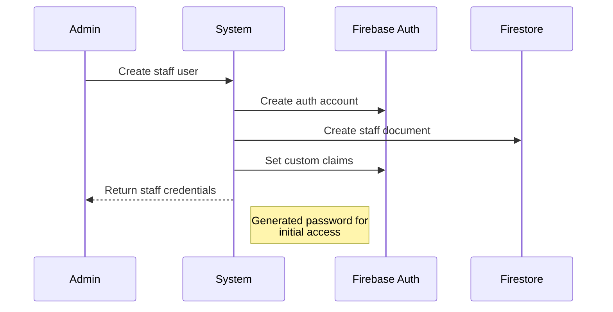
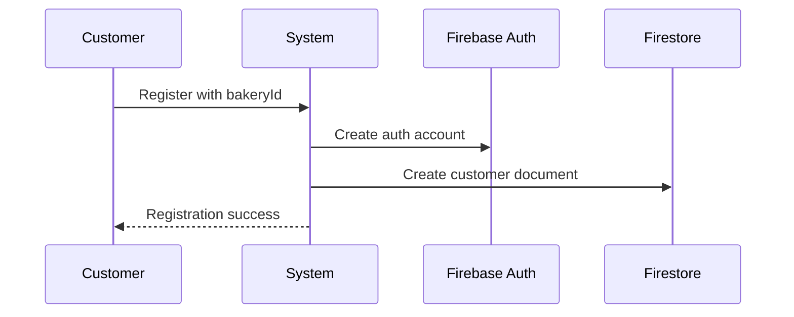
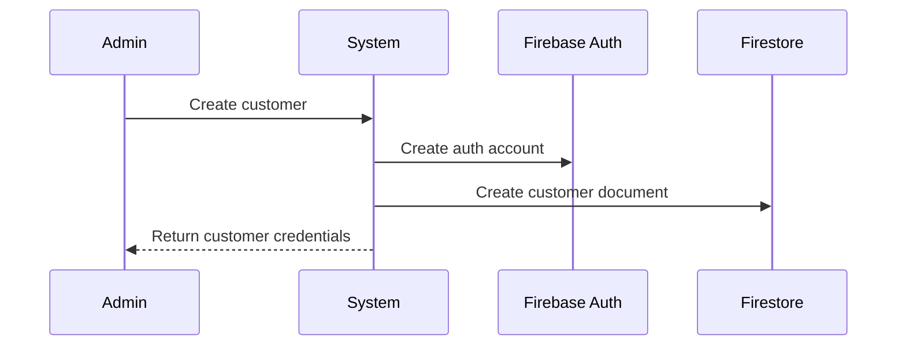

# User Management System Documentation

## Overview
The system implements a multi-tenant user management solution for bakeries with distinct user types and hierarchies. It uses Firebase Authentication for identity management and Firestore for user data storage.

## User Types

### 1. System Users (Admins)
- **Location**: `/users` collection
- **Types**:
  - `system_admin`: Global system administrator
  - `bakery_admin`: Owner/administrator of a specific bakery
- **Characteristics**:
  - One bakery admin per bakery
  - One bakery per admin
  - Created before bakery creation
  - Full access to their bakery's data

### 2. Bakery Users
- **Location**: `/bakeries/{bakeryId}/users` subcollection
- **Types**:
  - `bakery_staff`: Employees of the bakery
  - `bakery_customer`: Customers of the bakery
- **Characteristics**:
  - Belong to a specific bakery
  - Can have accounts in multiple bakeries
  - Staff created only by bakery admin
  - Customers can self-register or be admin-created

## Database Schema

### Admin User Document
```typescript
interface AdminUser {
  id: string;
  email: string;
  role: 'system_admin' | 'bakery_admin';
  bakeryId?: string;  // Only for bakery_admin
  name: string;
  createdAt: Timestamp;
  updatedAt: Timestamp;
  // Additional fields
  address?: string;
  phone?: string;
  national_id?: string;
}
```

### Bakery User Document
```typescript
interface BakeryUser {
  id: string;
  email: string;
  role: 'bakery_staff' | 'bakery_customer';
  name: string;
  isActive: boolean;  // Only relevant for staff
  createdAt: Timestamp;
  updatedAt: Timestamp;
  createdBy?: string;  // Reference to admin who created the user
  // Additional fields
  address?: string;
  phone?: string;
  birthday?: string;
  category?: string;
  comment?: string;
}
```

## Authentication Flows

### 1. Admin Registration
- Only through system administration
- Creates both Firebase Auth account and admin user document
- Automatically assigned admin role in Firebase custom claims

### 2. Staff Creation (by Admin)


### 3. Customer Creation
Flow A: Self-Registration


Flow B: Admin Creation


## Service Architecture

### AdminUserService
Responsibilities:
- Manage users in `/users` collection
- Handle bakery admin creation
- Manage system admin operations
- Update admin user details
- Handle admin authentication claims

### BakeryUserService
Responsibilities:
- Manage users in bakery subcollections
- Handle staff and customer creation
- Manage user data within bakery context
- Handle multi-bakery user scenarios
- Manage staff activation status

## API Endpoints

### Authentication Routes
```
POST /auth/register              # Public customer registration
POST /auth/login                 # All user login
POST /auth/logout               # All user logout
```

### Admin Routes
```
POST   /admin/users             # Create admin user (system admin only)
GET    /admin/users             # List admin users (system admin only)
GET    /admin/users/:id         # Get admin user details
PATCH  /admin/users/:id         # Update admin user
```

### Bakery User Routes
```
POST   /bakeries/:bakeryId/users           # Create staff/customer
GET    /bakeries/:bakeryId/users           # List bakery users
GET    /bakeries/:bakeryId/users/:id       # Get user details
PATCH  /bakeries/:bakeryId/users/:id       # Update user
GET    /bakeries/:bakeryId/users/staff     # List staff only
GET    /bakeries/:bakeryId/users/customers # List customers only
```

## Access Control Matrix

| Operation                | System Admin | Bakery Admin | Staff | Customer |
|-------------------------|--------------|--------------|--------|----------|
| Create Bakery Admin     | ✓            |              |        |          |
| Create Staff            |              | ✓            |        |          |
| Create Customer         |              | ✓            |        | ✓        |
| View All Users          | ✓            |              |        |          |
| View Bakery Users       |              | ✓            | ✓      |          |
| View Own Profile        | ✓            | ✓            | ✓      | ✓        |
| Update Own Profile      | ✓            | ✓            | ✓      | ✓        |
| Update Bakery Users     |              | ✓            |        |          |
| Deactivate Staff        |              | ✓            |        |          |

## Implementation Guidelines

### User Creation
1. Always create Firebase Auth account first
2. Use transactions for creating user documents
3. Set appropriate custom claims
4. Generate deterministic initial password
5. Validate email uniqueness within bakery context

### Security Rules
```javascript
match /users/{userId} {
  allow read: if isSystemAdmin();
  allow write: if isSystemAdmin();
}

match /bakeries/{bakeryId}/users/{userId} {
  allow read: if isBakeryAdmin(bakeryId) || 
              isBakeryStaff(bakeryId) ||
              (isBakeryCustomer(bakeryId) && isOwner(userId));
  allow write: if isBakeryAdmin(bakeryId);
}
```

### Error Handling
- Implement proper error handling for:
  - Duplicate email addresses
  - Invalid role assignments
  - Missing required fields
  - Authorization failures
  - Firebase Auth operations
  - Firestore operations

### Testing Considerations
- Unit test each service independently
- Test authentication flows
- Test access control
- Test multi-bakery scenarios
- Test user deactivation
- Test error conditions