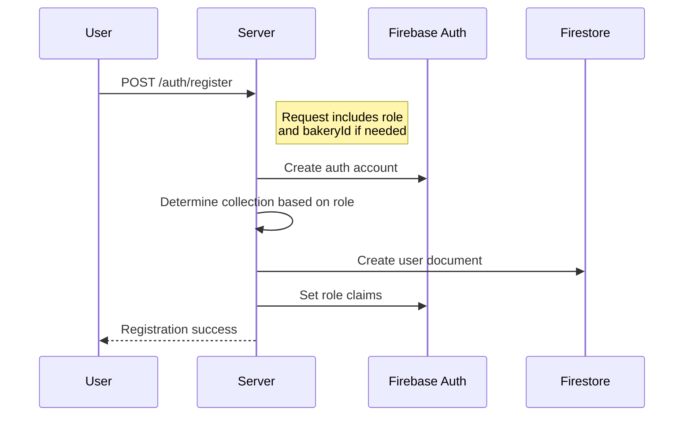
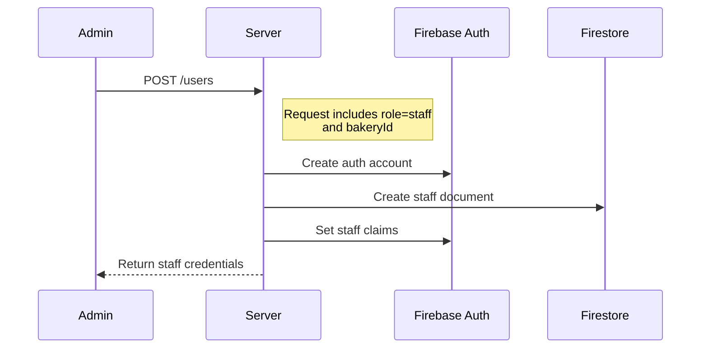

# User Management System Documentation

## Overview
The system implements a multi-tenant user management solution for bakeries with distinct user types and hierarchies. It uses Firebase Authentication for identity management and Firestore for user data storage.

## User Types

### 1. Admin Users
- **Location**: `/users` collection
- **Roles**:
  - `system_admin`: Global system administrator
  - `bakery_admin`: Owner/administrator of a specific bakery
- **Characteristics**:
  - One bakery admin per bakery
  - One bakery per admin
  - `bakery_admin` can self-register
  - Full access to their bakery's data

### 2. Bakery Users
- **Location**: `/bakeries/{bakeryId}/users` subcollection
- **Roles**:
  - `bakery_staff`: Employees of the bakery
  - `bakery_customer`: Customers of the bakery
- **Characteristics**:
  - Belong to a specific bakery
  - Can have accounts in multiple bakeries
  - Staff created only by bakery admin
  - Customers can self-register or be admin-created

## Database Schema

### User Model
```javascript
class User {
  constructor({
    id,
    email,
    password,
    role,          // bakery_customer, bakery_staff, bakery_admin, or system_admin
    bakeryId,      // Required for bakery_admin, bakery_staff, bakery_customer
    name,
    createdAt,
    updatedAt,
    category,
    address,       // Optional
    birthday,      // Optional
    comment,       // Optional
    phone,         // Optional
    national_id,   // Optional, typically for staff
    isActive = true
  }) {
    this.id = id;
    this.email = email;
    this.password = password;
    this.role = role;
    this.bakeryId = bakeryId;
    this.name = name;
    this.createdAt = createdAt || new Date();
    this.updatedAt = updatedAt || new Date();
    this.category = category || ""
    this.address = address || "";
    this.birthday = birthday || "";
    this.comment = comment || "";
    this.phone = phone || "";
    this.national_id = national_id || "";
    this.isActive = isActive;
  }
}
```

## Authentication Flows

### 1. Registration Flow


### 2. Staff Creation (by Admin)


### 3. Customer Creation (Admin or Self)
```mermaid
sequenceDiagram
    Actor->>Server: POST /users or /auth/register
    Note right of Server: Request includes role=customer<br/>and bakeryId
    Server->>Firebase Auth: Create auth account
    Server->>Firestore: Create customer document
    Server-->>Actor: Return success
```

## Service Architecture

### AdminUserService
Responsibilities:
- Manage users in `/users` collection
- Handle bakery admin operations
- Manage system admin operations
- Update admin user details
- Handle admin authentication claims

### BakeryUserService
Responsibilities:
- Manage users in bakery subcollections
- Handle staff and customer creation
- Manage user data within bakery context
- Handle multi-bakery user scenarios
- Manage staff activation status

## API Endpoints

### Authentication Routes (authRoutes.js)
```
POST /auth/register  # Public registration (handles both customers and bakery_admin)
POST /auth/login     # All user login
POST /auth/logout    # All user logout
```

### User Routes (userRoutes.js)
```
POST   /users        # Create user 
GET    /users        # List users (supports filtering via query params)
GET    /users/:id    # Get user details
PUT    /users/:id    # Update user
DELETE /users/:id    # Delete user
```

Query Parameters for GET /users:
- `role`: Filter by user role (bakery_customer, bakery_staff, bakery_admin, system_admin)
- `bakeryId`: Filter by bakery
- `isActive`: Filter by active status

## Access Control Matrix

| Operation     | System Admin | Bakery Admin | Staff | Customer |
|--------------|--------------|--------------|--------|----------|
| Register     | ✓            | ✓            | -      | ✓        |
| Create User  | ✓            | ✓ (in bakery)| -      | -        |
| View All     | ✓            | -            | -      | -        |
| View Bakery  | ✓            | ✓ (own)      | ✓      | -        |
| View Own     | ✓            | ✓            | ✓      | ✓        |
| Update User  | ✓            | ✓ (in bakery)| -      | -        |
| Update Own   | ✓            | ✓            | ✓      | ✓        |
| Delete User  | ✓            | ✓ (in bakery)| -      | -        |

## Implementation Guidelines

### User Creation
1. Always create Firebase Auth account first
2. Use transactions for creating user documents
3. Set appropriate custom claims
4. Generate deterministic initial password for staff
5. Validate email uniqueness within bakery context

### Security Rules
```javascript
match /users/{userId} {
  allow read: if isSystemAdmin() || isOwner(userId);
  allow write: if isSystemAdmin();
  allow create: if request.resource.data.role == 'bakery_admin';
}

match /bakeries/{bakeryId}/users/{userId} {
  allow read: if isBakeryAdmin(bakeryId) || 
              isBakeryStaff(bakeryId) ||
              (isBakeryCustomer(bakeryId) && isOwner(userId));
  allow write: if isBakeryAdmin(bakeryId) ||
              (isOwner(userId) && onlyAllowedFields());
}
```

### Error Handling
- Implement proper error handling for:
  - Duplicate email addresses
  - Invalid role assignments
  - Missing required fields
  - Authorization failures
  - Firebase Auth operations
  - Firestore operations

### Testing Considerations
- Unit test each service independently
- Test authentication flows
- Test access control
- Test multi-bakery scenarios
- Test user deactivation
- Test error conditions